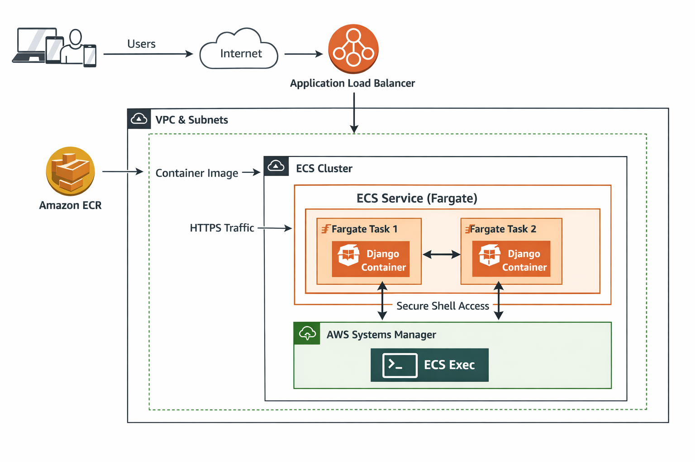

# Deploy Django Application on AWS using ECS and ECR



**This project demonstrates how to deploy a Django application on AWS using Amazon ECS with Fargate launch type and Amazon ECR.
The application is containerized using Docker, stored securely in ECR, and deployed serverlessly on ECS Fargate without managing EC2 instances..**

## Prerequisite
* Django
* Background on Docker
* AWS Account
* Creativity is always a plus 😃

## Django Web Framework
***Django is a high-level Python web framework that encourages rapid development and clean, pragmatic design. It is free and open-source, has a thriving and active community, great documentation, and many free and paid-for support options. It uses HTML/CSS/Javascript for the frontend and python for the backend.***

## What are Dockers and Containers?


### Docker Workflow
_*Docker is an open platform software. It is used for developing, shipping, and running applications. Docker virtualizes the operating system of the computer on which it is installed and running. It provides the ability to package and run an application in a loosely isolated environment called a container. A container is a runnable instance of a docker image. You can create, start, stop, move, or delete a container using the Docker API or CLI. You can connect a container to one or more networks, attach storage to it, or even create a new docker image based on its current state.*_

## What is AWS Elastic Container Registry?
_*Amazon Elastic Container Registry (Amazon ECR) is a managed container image registry service. Customers can use the familiar Docker CLI, or their preferred client, to push, pull, and manage images. Amazon ECR provides a secure, scalable, and reliable registry for your Docker images.*_

### ECR Steps
Here comes the task in which we create the repository on AWS using ECR where our application docker image will reside. To begin with the creation of a repository on ECR we first search ECR on AWS console and follows the below steps.

1. **Create a Docker File** — Add the “Dockerfile” to the Django application. It contains the series of command which will be required for the creation of docker image.

2. **Build your Docker Image** — Use the below command to create the docker image name as “django-app:version:1”.

```
docker build -t django-app 
```

3. Check whether the docker image is created or not using the below command.

```
docker images | django-app 
```

4. **Create Repository on AWS ECR** — It's time to open the AWS console and search for ECR. Then, click on the Create Repository button.

_*You will find two options for the visibility of your repository i.e, Private and Public. The Private repository access is managed by IAM and repository policy permissions. Once you click on create repository button then, you need to give the name of your repository. If you enabled the scan on push option then, it helps in identifying software vulnerabilities in your container images*_

5. **Push the created docker image of the Django application on Step 2 to AWS ECR** — 

a) Authenticate your Docker client to the Amazon ECR registry. Authentication tokens must be obtained for each registry used, and these tokens are valid for 12 hours. The easiest way of doing this is to get the AWS `AWS_ACCESS_KEY_ID` and `AWS_SECRET_ACCESS_KEY`. Then run the below command.

```
export AWS_ACCESS_KEY_ID=******
export AWS_SECRET_ACCESS_KEY=******
```
After exporting the `AWS_ACCESS_KEY_ID` and `AWS_SECRET_ACCESS_KEY`, login to the AWS account using the below command.

```
aws ecr get-login-password --region region | docker login --username AWS --password-stdin aws_account_id.dkr.ecr.region.amazonaws.com
```

b) Identify the image to push using the **docker images** command:

```
REPOSITORY                                                                TAG                     IMAGE ID          CREATED            SIZE
django-app    480903dd8        2 days ago          549MB
```

c) Tag your image with the Amazon ECR registry, repository, and optional image tag name combination to use. The registry format is `aws_account_id.dkr.ecr.region.amazonaws.com`. The repository name should match the repository that you created for your image.

The following example tags an image with the ID `480903dd8` as `aws_account_id.dkr.ecr.region.amazonaws.com/hello-world-django-app`.

```
docker tag 480903dd8 aws_account_id.dkr.ecr.region.amazonaws.com/hello-world-django-app
```

d) Push the docker image using the **docker push** command:

```
docker push aws_account_id.dkr.ecr.region.amazonaws.com/hello-world-django-app
```

## What is AWS Elastic Container Service?
*_Amazon Elastic Container Service (ECS) is a highly scalable, high-performance container management service that supports Docker containers and allows you to easily run applications on a managed cluster of Amazon EC2 instances. With Amazon ECS we can install, operate and scale our application with its own cluster management infrastructure. Using some simple API calls, we can launch and stop our Docker-enabled applications, query the logs of our cluster, and access many familiar features like security groups, Elastic Load Balancer, EBS volumes, and IAM roles. We can use Amazon ECS to schedule the placement of containers across our cluster based on our resource needs and availability requirements. We can also integrate our own scheduler or third-party schedulers to meet business or application-specific requirements._*

### ECS Steps
Now the time has come to launch our first EC2 instance using AWS ECS. To begin with, let’s first search ECS on AWS console and follows the below steps.

1. **Create Cluster** — The cluster creation console provides a simple way to create the resources and it lets you customize several common cluster configuration options. Don’t forget to select the region to use your cluster from the navigation pane.

2. **Create Task Definition** — The task definition is the blueprint of your Django container. It defines the Docker image (from ECR), CPU and memory, ports, environment variables, and enables ECS Exec for container access.

3. **Create ECS Service** — An ECS service ensures your Fargate tasks keep running. It maintains the desired task count and handles networking and load balancer integration if configured.

4. **Access Container using ECS Exec** — ECS Exec allows you to run commands inside a running container without SSH, using AWS Systems Manager for secure access.


## Access Container using ECS Exec
*_Access Container using ECS Exec
This section explains how ECS Exec is enabled and used to access a running container in a Fargate-based ECS service. The task definition is first retrieved and updated to ensure it uses the correct IAM roles, networking mode (awsvpc), and Fargate compatibility. Once the updated task definition is registered and running in the service, ECS Exec allows you to securely open an interactive shell (/bin/sh) inside the container. The connection is handled through AWS Systems Manager, so no SSH access or public IP is required._*

```
aws ecs describe-task-definition --task-definition django-task
```

```
nano task-def.json
{
  "family": "task-definition-fargate",
  "networkMode": "awsvpc",
  "requiresCompatibilities": ["FARGATE"],
  "cpu": "1024",
  "memory": "3072",
  "executionRoleArn": "arn:aws:iam::939095374446:role/LabRole",
  "taskRoleArn": "arn:aws:iam::939095374446:role/LabRole",
  "containerDefinitions": [
    {
      "name": "my-app",
      "image": "939095374446.dkr.ecr.us-east-1.amazonaws.com/djanggo-app@sha256:...",
      "cpu": 0,
      "essential": true,
      "portMappings": [
        {
          "containerPort": 8000,
          "hostPort": 8000,
          "protocol": "tcp",
          "name": "my-app-8000-tcp",
          "appProtocol": "http"
        }
      ],
      "logConfiguration": {
        "logDriver": "awslogs",
        "options": {
          "awslogs-group": "/ecs/task-definition-fargate",
          "awslogs-create-group": "true",
          "awslogs-region": "us-east-1",
          "awslogs-stream-prefix": "ecs"
        }
      }
    }
  ]
}
```

```
aws ecs register-task-definition --cli-input-json file://task-def.json
```

```
aws ecs list-tasks \
  --cluster djanggo-cluster-fargate \
  --service-name django-service
```

```
aws ecs execute-command \
  --cluster djanggo-cluster-fargate \
  --task <TASK_ID> \
  --container django \
  --interactive \
  --command "/bin/sh"
```

create username & password for login
```
python manage.py createsuperuser
```


## Congratulazioni! 🙂
_*We have Successfully deployed our Django Application on AWS cloud using ECS and ECR.*_

As a Page of victory, check if the Django application is running correctly or not by navigating to the public DNS of the instance in the browser.

Many other factors come into play when we deploy a full-fledged Django application on the production server. Some of these factors are as below:

* Security
* Monitoring
* Load balancing
* Recovery Plans

To fulfill some of these factors, one can also use the `AWS Beanstalk` service to deploy Django apps more efficiently.

**Happy Learning!**

# Hit the Star! ⭐
***If you are planning to use this repo for learning, please hit the star. Thanks!***

#### Author by [DevCloud Ninjas](https://github.com/DevCloudNinjas)


