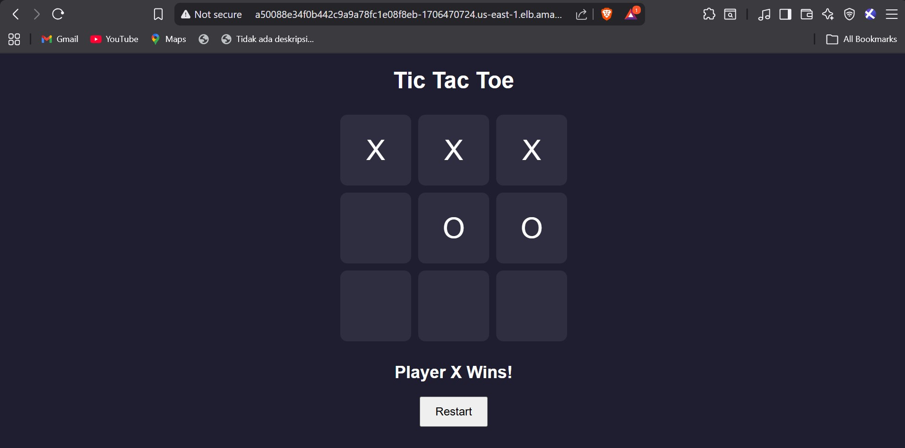

# Kubernetes End to End Project on EKS(Amazon Kubernetes Service)


## **Prerequisites**:

**kubectl** – A command line tool for working with Kubernetes clusters. For more information, see Installing or updating kubectl.

**eksctl** – A command line tool for working with EKS clusters that automates many individual tasks. For more information, see Installing or updating.

**AWS CLI** – A command line tool for working with AWS services, including Amazon EKS. For more information, see Installing, updating, and uninstalling the AWS CLI in the AWS Command Line Interface User Guide. After installing the AWS CLI, we recommend that you also configure it. For more information, see Quick configuration with aws configure in the AWS Command Line Interface User Guide.

## ✅ Project Title: Deploying 2048 Game App on Amazon EKS

## ✅ Project Description: 
***A Kubernetes End-to-End (E2E) project for deploying a 2048 game app on Amazon Elastic Kubernetes Service (EKS) involves setting up, deploying, and managing the popular 2048 game application on a Kubernetes cluster running on AWS EKS. This project aims to demonstrate how to containerize a web application, deploy it on EKS, manage the cluster, and expose the application to users.***

## ✅ Containerization: 
***I began by containerizing the 2048 game using Docker. This involved creating a Dockerfile to define the application's runtime environment and dependencies, ultimately resulting in a Docker image ready for deployment.***

## ✅ Amazon EKS Setup: 
***I set up an Amazon EKS cluster, configuring the required resources and network settings using AWS services. This step included authentication and permissions setup to interact with the EKS cluster.***

## ✅ Deployment: 
***The containerized 2048 game was deployed on the EKS cluster using Kubernetes. I defined Kubernetes deployment and service YAML files to ensure the application's efficient management and availability.***

## ✅ Scaling and Management: 
***I explored Kubernetes's scaling capabilities, adjusting the number of application replicas based on demand. This ensured the game could handle varying levels of user traffic seamlessly***

## ✅ Application Exposure: 
***To make the 2048 game accessible to users, I created a Kubernetes service to expose it securely over the internet. Additionally, I could have implemented an Ingress controller for more advanced routing***

### Step 1: Create an EKS cluster
To build the infrastructure, run the following commands:
```
cd terraform
terraform init
terraform apply
```
Ensure that the AWS CLI is properly configured before running these commands.

### Step 2: Authenticate to this cluster

```
Reference:
https://docs.aws.amazon.com/eks/latest/userguide/create-kubeconfig.html

Open cloudshell

# Type on your AWS CLI window 
aws sts get-caller-identity
# observe your account and user id details

# Create a  kubeconfig file where it stores the credentials for EKS:
# kubeconfig configuration allows you to connect to your cluster using the kubectl command line.
aws eks update-kubeconfig --region region-code --name my-cluster
ex: aws eks update-kubeconfig --region us-east-1 --name my-cluster # Use the cluster name you just 
created


# see if you can get the nodes you created
kubectl get nodes

# Install nano editor in cloudshell. We will need this in the next task
sudo yum install nano -y
```

### Step 3: Create a new POD & Service in EKS for the tictactoe game

```
apiVersion: v1
kind: Pod
metadata:
  name: tictactoe-pod
  labels:
    app: myapp
spec:
  containers:
  - name: tictactoe-pod
    image: destiaeka/tictactoe
    ports:
      - containerPort: 80

---
apiVersion: v1
kind: Service
metadata:
  name: tictactoe-service
spec:
  type: LoadBalancer
  selector:
    app: myapp
  ports:
    - port: 80
      targetPort: 80
```

```
# apply the config file to create the pod
kubectl apply -f game.yaml
#pod/tictactoe-pod created
#service/tictactoe-service created

# view the newly created pod
kubectl get pods
```

### Step 4: Check and Access pod using External-IP
```
# view all resource
~ $ kubectl get all
NAME                READY   STATUS    RESTARTS   AGE
pod/tictactoe-pod   1/1     Running   0          73s

NAME                        TYPE           CLUSTER-IP      EXTERNAL-IP                                                               PORT(S)        AGE
service/kubernetes          ClusterIP      10.100.0.1      <none>                                                                    443/TCP        10m
service/tictactoe-service   LoadBalancer   10.100.249.87   a50088e34f0b442c9a9a78fc1e08f8eb-1706470724.us-east-1.elb.amazonaws.com   80:32177/TCP   73s
```

```
# Access the LoadBalancer on the web browser
a50088e34f0b442c9a9a78fc1e08f8eb-1706470724.us-east-1.elb.amazonaws.com
```


# Thank you
Thank you for taking the time to work on this tutorial/labs. Let me know what you thought!


#### Author by [DevCloud Ninjas](https://github.com/DevCloudNinjas)

Ensure to follow me on GitHub. Please star/share this repository!


